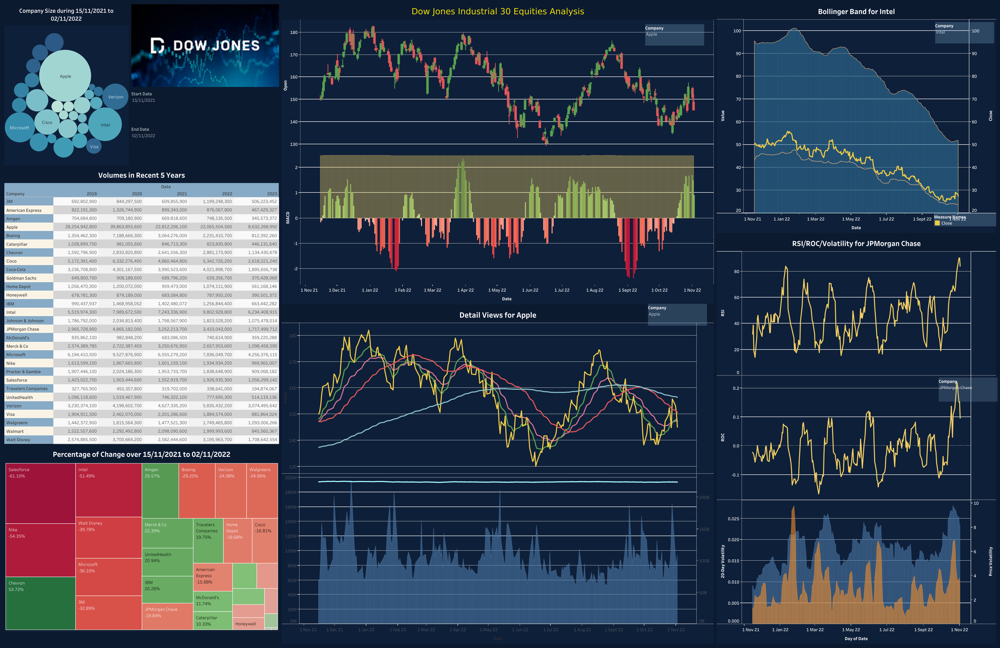

# Financial Equity (Dow Jones 30 Industrial Equities) Dashboard with Tableau

This repository hosts an interactive financial equity dashboard meticulously crafted using Tableau. The visualization techniques employed in this project provide a comprehensive perspective into the multifaceted realm of equity data and present a holistic view of financial market dynamics.

## **Preview:**  

### You can try it with the following link:  
**[DashBoard Live](https://public.tableau.com/views/Stock_Dash/Dashboard1?:language=en-US&:display_count=n&:origin=viz_share_link)**

## 📈 **Features**

### **1. Candlestick Chart**
A classic in financial analysis, offering a snapshot of the open, close, high, and low prices over a specified period.

### **2. MACD Plot**
The Moving Average Convergence Divergence (MACD) plot to capture momentum and trend reversals.

### **3. Moving Averages**
- **MA50 & MA200**: 50-day and 200-day moving averages to track short-term and long-term market trends.
- **EMA12 & EMA26**: Exponential moving averages to give weightage to recent prices and react faster to price changes.

### **4. Volume Area Chart**
A visual representation of trading volume over time, providing insights into the strength or weakness of a price trend.

### **5. Company Size Bubble Chart**
A dynamic visualization comparing companies based on their market capitalization.

### **6. Volatility Chart**
A tool to capture price variation and gauge market uncertainty.

### **7. Heatmap of Price Changes**
Visualizes the price change over specific periods, enabling an at-a-glance understanding of market performance.

### **8. Company Volume Table**
A detailed breakdown of traded volumes across different companies.

### **9. RSI (Relative Strength Index)**
A momentum oscillator to identify overbought or oversold conditions.

### **10. ROC (Rate of Change)**
Demonstrates the speed at which a variable changes over a specific period.

### **11. Bollinger Bands**
A volatility indicator consisting of a middle band being an N-period simple moving average (SMA) and an upper and lower band.

### **12. OBV (On-Balance Volume) Area Chart**
Measures buying and selling pressure as a cumulative indicator.

... and more.

## 🛠 **Data & Tooling**

**Source Data**: Raw datasets sourced from Yahoo Finance.

**Data Engineering**: The data was meticulously curated and enhanced using Python, making it suitable for sophisticated visualization techniques in Tableau.

**Tableau Calculated Fields**: Custom fields created within Tableau to derive valuable financial metrics.

## 📝 **Notes**

This project is a testament to the power of Tableau in visualizing intricate financial data. Contributions, suggestions, and feedback are always welcome!

---

To set up and run the project, follow the instructions below:

...

